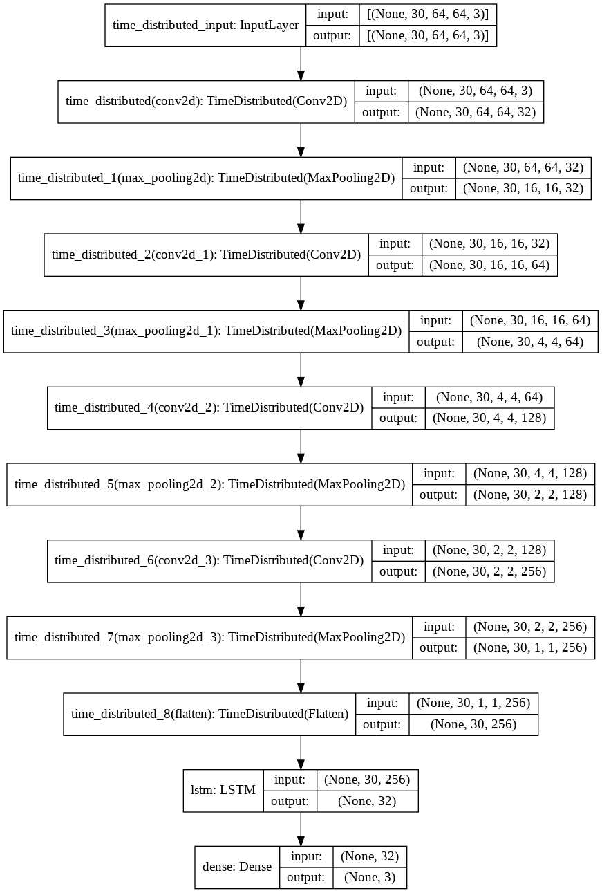

# Abnormal-Activity-Detection-Deep-Learning
## Unveiling Abnormality: Real-time Anomaly Detection with LRCN Deep Learning

- The Abnormal-Activity-Detection-using Deep-Learning LRCN project focuses on developing a deep learning model for detecting abnormal behavior in videos. The project utilizes the Long-term Recurrent Convolutional Network (LRCN), which combines the power of convolutional neural networks (CNNs) and recurrent neural networks (RNNs).

- The LRCN model offers the advantage of reduced computational time compared to previous models, making it suitable for real-time detection. By leveraging 11 layers instead of the time-consuming 16 layers of the VGG-16 model, the LRCN model achieves efficient processing without sacrificing accuracy.

- To optimize memory usage, the project team resized video frames from 224px to 64px while maintaining sufficient detail for anomaly detection. The dataset used for training the model consists of videos containing both abnormal behavior, such as fighting, and normal behavior, including walking and running. This diverse dataset enhances the model's ability to accurately identify and classify anomalous activities.

- With an achieved accuracy of 82% on their custom dataset, the Abnormal-Activity-Detection-using Deep-Learning LRCN project showcases the potential of deep learning techniques to detect and analyze abnormal behavior in videos.


# Tools:
- [Tensorflow](https://www.tensorflow.org/io)
- [Keras](https://keras.io/)
- [scikit-learn](https://scikit-learn.org/stable/)
- [moviepy](https://zulko.github.io/moviepy/)
- [Matplotlib](https://matplotlib.org/)

# Long-term recurrent convolutional network (LRCN):

- [LRCN Model](https://sh-tsang.medium.com/brief-review-lrcn-long-term-recurrent-convolutional-networks-for-visual-recognition-and-9542bc7e8a79)



# Getting Started:
After cloning the repository to local machine.
To run the project locally, run the following CLI commands.
```
pip install -r requirements.txt ## Install all the dependencies
```
### Note - The cell execution requires a lot of resources and might fail on low end PCs. Please Run in Google Colab if having Low end PC.

- Run all the cells of Human_Activity_Detection_Model_Creation.ipynb for Model Creation and training.
- Run all the cells of Human_Activity_Detection_Model_Prediction.ipynb for Predicting the Class of the video.
- For Single action detection run predict_single_action(video_file_path, SEQUENCE_LENGTH) function with video path and sequence length as input.
- For prediction of actions in the whole video run predict_on_video(video_file_path, output_file_path, SEQUENCE_LENGTH) function with input video path, output video path, sequence length as input, an output video file with predicted classes on top of the video will be saved in the output path.
